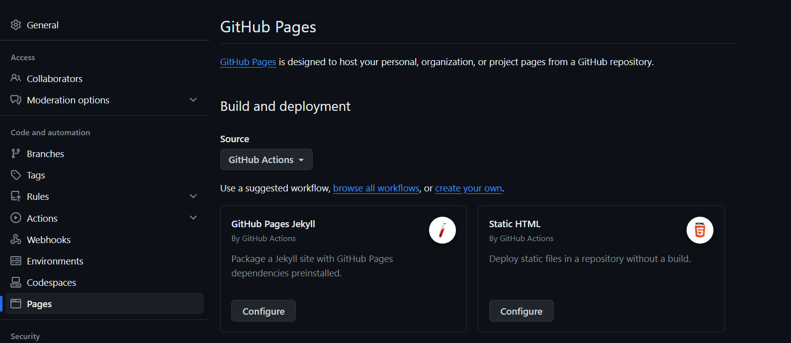
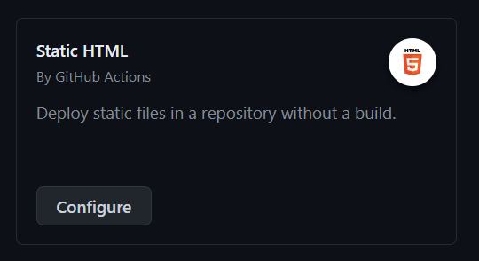
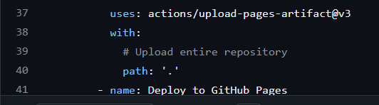
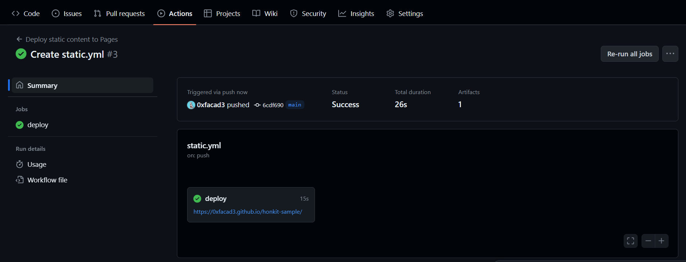

# settings

1. Active github pages with Github Actions.

2. Select "Static HTML" Workflow configure.

3. Set path that have docs content (index.html) and Commit that.

4. Check the actions workflow results.

5. You can check the site honkit with your github.io domain.

ex. https://0xfacad3.github.io/honkit-sample/
